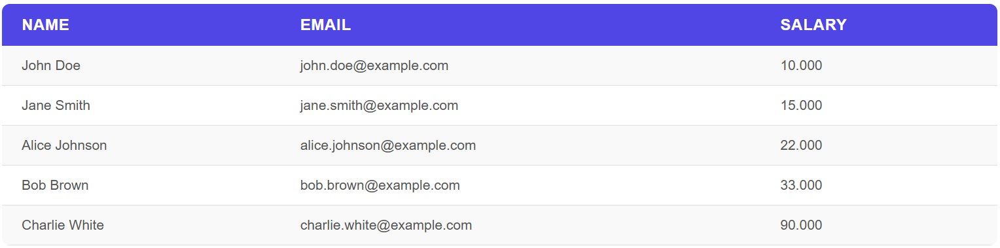
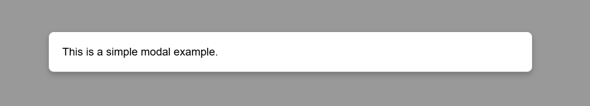
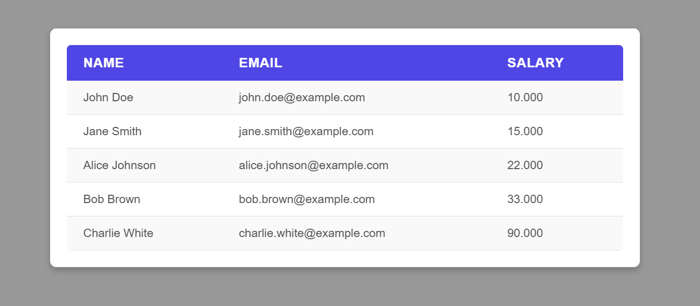

# simple-components

## Table



```
import { Table } from "/components/table.js";

const headerData = ["Name", "Email", "Salary"];
const jsonData = await (await fetch("customers.json")).json();
const targetElement = document.getElementById("customer-table");

const table = new Table();
table.load(jsonData, headerData, targetElement);
```

## Modal



```
import { Modal } from "/components/modal.js";

const sourceElement = document.getElementById("text-modal-button");
const targetElement = document.getElementById("text-modal");

const modal = new Modal();
modal.load(sourceElement, targetElement);
```

## Modal with Table



```
import { Table } from "/components/table.js";
import { Modal } from "/components/modal.js";

const headerData = ["Name", "Email", "Salary"];
const jsonData = await (await fetch("customers.json")).json();
const targetElement = document.getElementById("table-modal");
const sourceElement = document.getElementById("table-modal-button");

const table = new Table();
table.load(jsonData, headerData, targetElement);

const modal = new Modal();
modal.load(sourceElement, targetElement);
```

## CDN

[https://cdn.jsdelivr.net/gh/gartenkralle/simple-components@1.0.3/components/table.js](https://cdn.jsdelivr.net/gh/gartenkralle/simple-components@1.0.3/components/table.js)
[https://cdn.jsdelivr.net/gh/gartenkralle/simple-components@1.0.3/components/modal.js](https://cdn.jsdelivr.net/gh/gartenkralle/simple-components@1.0.3/components/modal.js)

[https://cdn.jsdelivr.net/gh/gartenkralle/simple-components@1.0.3/components/button.css](https://cdn.jsdelivr.net/gh/gartenkralle/simple-components@1.0.3/components/button.css)
[https://cdn.jsdelivr.net/gh/gartenkralle/simple-components@1.0.3/components/modal.css](https://cdn.jsdelivr.net/gh/gartenkralle/simple-components@1.0.3/components/modal.css)
[https://cdn.jsdelivr.net/gh/gartenkralle/simple-components@1.0.3/components/table.css](https://cdn.jsdelivr.net/gh/gartenkralle/simple-components@1.0.3/components/table.css)
