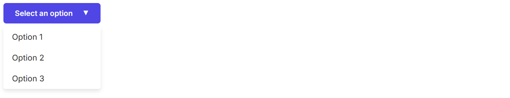

# simple-components

## Table


```javascript
import { Table } from "/components/table.js";

const headerData = ["Name", "Email", "Salary"];

const response = await fetch("data/customers.json");
const bodyData = await response.json();

const targetElement = document.querySelector("#table-example");

const table = new Table(headerData, bodyData);
table.show(targetElement);
```

## Modal


```javascript
import { Button } from "/components/button.js";
import { Table } from "/components/table.js";
import { Modal } from "/components/modal.js";

const headerData = ["Name", "Email", "Salary"];

const response = await fetch("data/customers.json");
const bodyData = await response.json();

const sourceElement = document.querySelector("#modal-button");

const table = new Table(headerData, bodyData);
const modal = new Modal();

const button = new Button("Button inside modal");

modal.add(table.htmlElement);
modal.add(button.htmlElement);

modal.connect(sourceElement);
```

## Tab


```javascript
import { Table } from "/components/table.js";
import { Tab } from "/components/tab.js";

const orderHeaderData = ["Id", "Customer Id", "Order Date", "Shipping Date", "State", "Total Amount", "Payment Method"];
const customerHeaderData = ["Name", "Email", "Salary"];
const addressHeaderData = ["Id", "Customer Id", "Name", "Street", "City", "State", "Postal Code", "Country", "Phone", "Type"];

const orderResponse = await fetch("data/orders.json");
const orderBodyData = await orderResponse.json();

const customerResponse = await fetch("data/customers.json");
const customerBodyData = await customerResponse.json();

const addressResponse = await fetch("data/address.json");
const addressBodyData = await addressResponse.json();

const orderTable = new Table(orderHeaderData, orderBodyData);
const customerTable = new Table(customerHeaderData, customerBodyData);
const addressTable = new Table(addressHeaderData, addressBodyData);

const targetElement = document.querySelector("#tab-example");

const tab = new Tab();

tab.add("Orders", orderTable.htmlElement);
tab.add("Customers", customerTable.htmlElement);
tab.add("Addresses", addressTable.htmlElement);

tab.show(targetElement);
```

## Dropdown



```javascript
import { Dropdown} from '/components/dropdown.js'

const options = ['Option 1', 'Option 2', 'Option 3'];

const dropdown = new Dropdown(options);
const targetElement = document.querySelector('#dropdown-example');

dropdown.show(targetElement);
```

## CDN

### JS

[https://cdn.jsdelivr.net/gh/gartenkralle/simple-components@1.0.9/components/button.js](https://cdn.jsdelivr.net/gh/gartenkralle/simple-components@1.0.9/components/button.js)
[https://cdn.jsdelivr.net/gh/gartenkralle/simple-components@1.0.9/components/dropdown.js](https://cdn.jsdelivr.net/gh/gartenkralle/simple-components@1.0.9/components/dropdown.js)
[https://cdn.jsdelivr.net/gh/gartenkralle/simple-components@1.0.9/components/table.js](https://cdn.jsdelivr.net/gh/gartenkralle/simple-components@1.0.9/components/table.js)
[https://cdn.jsdelivr.net/gh/gartenkralle/simple-components@1.0.9/components/modal.js](https://cdn.jsdelivr.net/gh/gartenkralle/simple-components@1.0.9/components/modal.js)
[https://cdn.jsdelivr.net/gh/gartenkralle/simple-components@1.0.9/components/tab.js](https://cdn.jsdelivr.net/gh/gartenkralle/simple-components@1.0.9/components/tab.js)

### CSS
[https://cdn.jsdelivr.net/gh/gartenkralle/simple-components@1.0.9/css/button.css](https://cdn.jsdelivr.net/gh/gartenkralle/simple-components@1.0.9/css/button.css)
[https://cdn.jsdelivr.net/gh/gartenkralle/simple-components@1.0.9/css/dropdown.css](https://cdn.jsdelivr.net/gh/gartenkralle/simple-components@1.0.9/css/dropdown.css)
[https://cdn.jsdelivr.net/gh/gartenkralle/simple-components@1.0.9/css/table.css](https://cdn.jsdelivr.net/gh/gartenkralle/simple-components@1.0.9/css/table.css)
[https://cdn.jsdelivr.net/gh/gartenkralle/simple-components@1.0.9/css/modal.css](https://cdn.jsdelivr.net/gh/gartenkralle/simple-components@1.0.9/css/modal.css)
[https://cdn.jsdelivr.net/gh/gartenkralle/simple-components@1.0.9/css/tab.css](https://cdn.jsdelivr.net/gh/gartenkralle/simple-components@1.0.9/css/tab.css)
