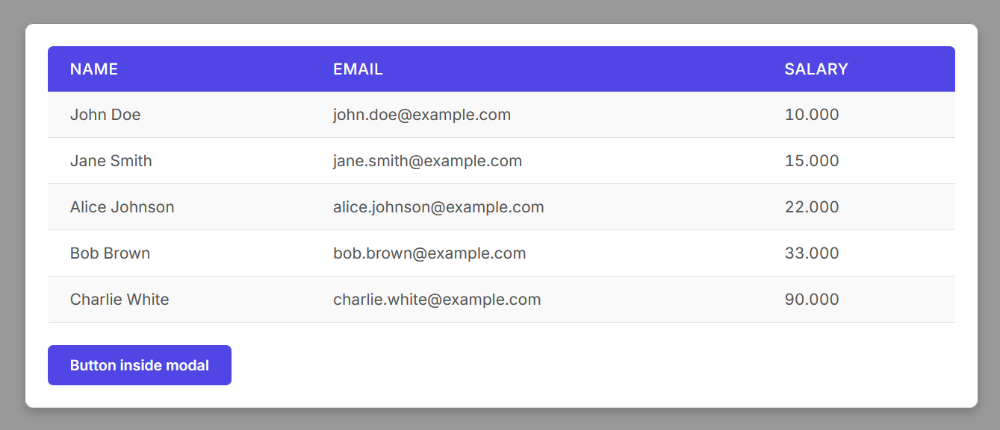

[](https://www.jsdelivr.com/package/gh/gartenkralle/simple-components)

# simple-components

## Button


```javascript
import { Button } from "/components/js/button.js";

const button = new Button("Button example");

const targetElement = document.querySelector("#button-example");

button.attach(targetElement);
```

## SoftButton


```javascript
import { SoftButton } from "/components/js/softbutton.js";

const button = new SoftButton("Softbutton example");

const targetElement = document.querySelector("#softbutton-example");

button.attach(targetElement);
```

## Table


```javascript
import { Table } from "/components/js/table.js";

const headerData = ["Name", "Email", "Salary"];

const response = await fetch("data/customers.json");
const bodyData = await response.json();

const targetElement = document.querySelector("#table-example");

const table = new Table(headerData, bodyData);

table.attach(targetElement);
```

## Modal



```javascript
import { Button } from "/components/js/button.js";
import { Table } from "/components/js/table.js";
import { Modal } from "/components/js/modal.js";

const headerData = ["Name", "Email", "Salary"];

const response = await fetch("data/customers.json");
const bodyData = await response.json();

const sourceElement = document.querySelector("#modal-button");

const table = new Table(headerData, bodyData);
const modal = new Modal();

const button = new Button("Button inside modal");

modal.add(table.htmlElement);
modal.add(button.htmlElement);

modal.connect(sourceElement);
```

## Tab


```javascript
import { Table } from "/components/js/table.js";
import { Tab } from "/components/js/tab.js";

const orderHeaderData = ["Id", "Customer Id", "Order Date", "Shipping Date", "State", "Total Amount", "Payment Method"];
const customerHeaderData = ["Name", "Email", "Salary"];
const addressHeaderData = ["Id", "Customer Id", "Name", "Street", "City", "State", "Postal Code", "Country", "Phone", "Type"];

const orderResponse = await fetch("data/orders.json");
const orderBodyData = await orderResponse.json();

const customerResponse = await fetch("data/customers.json");
const customerBodyData = await customerResponse.json();

const addressResponse = await fetch("data/address.json");
const addressBodyData = await addressResponse.json();

const orderTable = new Table(orderHeaderData, orderBodyData);
const customerTable = new Table(customerHeaderData, customerBodyData);
const addressTable = new Table(addressHeaderData, addressBodyData);

const targetElement = document.querySelector("#tab-example");

const tab = new Tab();

tab.add("Orders", orderTable.htmlElement);
tab.add("Customers", customerTable.htmlElement);
tab.add("Addresses", addressTable.htmlElement);

tab.attach(targetElement);
```

## Dropdown


```javascript
import { Dropdown } from "/components/js/dropdown.js";

const options = ["Option 1", "Option 2", "Option 3"];
const text = "Select an option";
const dropdown = new Dropdown(text, options);
const targetElement = document.querySelector("#dropdown-example");

dropdown.attach(targetElement);
```

## Textarea


```javascript
import { Textarea } from "/components/js/textarea.js";

const placeholder = "This is a placeholder";

const textarea = new Textarea(placeholder, 10);

const targetElement = document.querySelector("#textarea-example");

textarea.attach(targetElement);
```

## Radiogroup


```javascript
import { Radiogroup } from "/components/js/radiogroup.js";

const radiogroup = new Radiogroup("Which option do you want to choose?");

radiogroup.add("Option 1");
radiogroup.add("Option 2");
radiogroup.add("Option 3");

const targetElement = document.querySelector("#radiogroup-example");

radiogroup.attach(targetElement);
```

## Textbox


```javascript
import { Textbox } from "/components/js/textbox.js";

const textbox = new Textbox();

const targetElement = document.querySelector("#textbox-example");

textbox.attach(targetElement);
```

## Slider


```javascript
import { Slider } from "/components/js/slider.js";

const slider = new Slider("Slider label");

const targetElement = document.querySelector("#slider-example");

slider.attach(targetElement);
```

## CDN

### JS

[https://cdn.jsdelivr.net/gh/gartenkralle/simple-components@1.3.16/components/js/button.js](https://cdn.jsdelivr.net/gh/gartenkralle/simple-components@1.3.16/components/js/button.js)
[https://cdn.jsdelivr.net/gh/gartenkralle/simple-components@1.3.16/components/js/softbutton.js](https://cdn.jsdelivr.net/gh/gartenkralle/simple-components@1.3.16/components/js/softbutton.js)
[https://cdn.jsdelivr.net/gh/gartenkralle/simple-components@1.3.16/components/js/dropdown.js](https://cdn.jsdelivr.net/gh/gartenkralle/simple-components@1.3.16/components/js/dropdown.js)
[https://cdn.jsdelivr.net/gh/gartenkralle/simple-components@1.3.16/components/js/table.js](https://cdn.jsdelivr.net/gh/gartenkralle/simple-components@1.3.16/components/js/table.js)
[https://cdn.jsdelivr.net/gh/gartenkralle/simple-components@1.3.16/components/js/modal.js](https://cdn.jsdelivr.net/gh/gartenkralle/simple-components@1.3.16/components/js/modal.js)
[https://cdn.jsdelivr.net/gh/gartenkralle/simple-components@1.3.16/components/js/tab.js](https://cdn.jsdelivr.net/gh/gartenkralle/simple-components@1.3.16/components/js/tab.js)
[https://cdn.jsdelivr.net/gh/gartenkralle/simple-components@1.3.16/components/js/textarea.js](https://cdn.jsdelivr.net/gh/gartenkralle/simple-components@1.3.16/components/js/textarea.js)
[https://cdn.jsdelivr.net/gh/gartenkralle/simple-components@1.3.16/components/js/radiogroup.js](https://cdn.jsdelivr.net/gh/gartenkralle/simple-components@1.3.16/components/js/radiogroup.js)
[https://cdn.jsdelivr.net/gh/gartenkralle/simple-components@1.3.16/components/js/textbox.js](https://cdn.jsdelivr.net/gh/gartenkralle/simple-components@1.3.16/components/js/textbox.js)
[https://cdn.jsdelivr.net/gh/gartenkralle/simple-components@1.3.16/components/js/slider.js](https://cdn.jsdelivr.net/gh/gartenkralle/simple-components@1.3.16/components/js/slider.js)

### CSS

[https://cdn.jsdelivr.net/gh/gartenkralle/simple-components@1.3.16/components/css/button.css](https://cdn.jsdelivr.net/gh/gartenkralle/simple-components@1.3.16/components/css/button.css)
[https://cdn.jsdelivr.net/gh/gartenkralle/simple-components@1.3.16/components/css/softbutton.css](https://cdn.jsdelivr.net/gh/gartenkralle/simple-components@1.3.16/components/css/softbutton.css)
[https://cdn.jsdelivr.net/gh/gartenkralle/simple-components@1.3.16/components/css/dropdown.css](https://cdn.jsdelivr.net/gh/gartenkralle/simple-components@1.3.16/components/css/dropdown.css)
[https://cdn.jsdelivr.net/gh/gartenkralle/simple-components@1.3.16/components/css/table.css](https://cdn.jsdelivr.net/gh/gartenkralle/simple-components@1.3.16/components/css/table.css)
[https://cdn.jsdelivr.net/gh/gartenkralle/simple-components@1.3.16/components/css/modal.css](https://cdn.jsdelivr.net/gh/gartenkralle/simple-components@1.3.16/components/css/modal.css)
[https://cdn.jsdelivr.net/gh/gartenkralle/simple-components@1.3.16/components/css/tab.css](https://cdn.jsdelivr.net/gh/gartenkralle/simple-components@1.3.16/components/css/tab.css)
[https://cdn.jsdelivr.net/gh/gartenkralle/simple-components@1.3.16/components/css/textarea.css](https://cdn.jsdelivr.net/gh/gartenkralle/simple-components@1.3.16/components/css/textarea.css)
[https://cdn.jsdelivr.net/gh/gartenkralle/simple-components@1.3.16/components/css/radiogroup.css](https://cdn.jsdelivr.net/gh/gartenkralle/simple-components@1.3.16/components/css/radiogroup.css)
[https://cdn.jsdelivr.net/gh/gartenkralle/simple-components@1.3.16/components/css/textbox.css](https://cdn.jsdelivr.net/gh/gartenkralle/simple-components@1.3.16/components/css/textbox.css)
[https://cdn.jsdelivr.net/gh/gartenkralle/simple-components@1.3.16/components/css/slider.css](https://cdn.jsdelivr.net/gh/gartenkralle/simple-components@1.3.16/components/css/slider.css)
